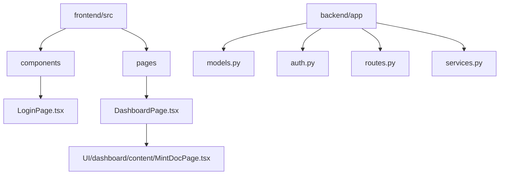

# Code Walkthrough

This reference explains where to find all the major features of Essentialis in the codebase. If you’re looking to understand or extend the app, start here!

---

## Directory Structure

- **frontend/src/components/** — Reusable UI elements (e.g., LoginPage, Navigation)
- **frontend/src/pages/** — Main screens (e.g., Documentation, Blog, Homepage)
- **backend/app/models.py** — Database models (User, document ownership, etc.)
- **backend/app/auth.py** — Authentication and wallet login APIs
- **backend/app/routes.py** — Core API endpoints for user, document, sharing, NFT
- **backend/app/services.py** — Helpers, blockchain actions, third-party integrations

---

## Key Frontend Pages & Components
- `LoginPage.tsx`: Handles email, Google, and wallet login flows.
- `DashboardPage.tsx`: Main authenticated area; contains navigation and child components for document management.
- `MintDocPage.tsx`, `MyDocs.tsx`: Document uploading, minting, viewing.
- `Navigation.tsx`: Sidebar and topbar menus.

---

## Key Backend Models & APIs
- `User`: in models.py. All user data and auth secrets.
- Auth endpoints: in auth.py. `/register`, `/login`, `/otp`, etc.
- Document upload, storage, sharing, and blockchain audit: in routes.py and services.py.

---

## Extending the Platform
- Add new React components to `/src/components`.
- New API endpoints go in `backend/app/routes.py`.
- Blockchain/contract logic is managed in services.py and with configuration via `config.py`.
- For frontend-backend integration: see API fetch calls in `frontend/src/pages/` and main component files.
